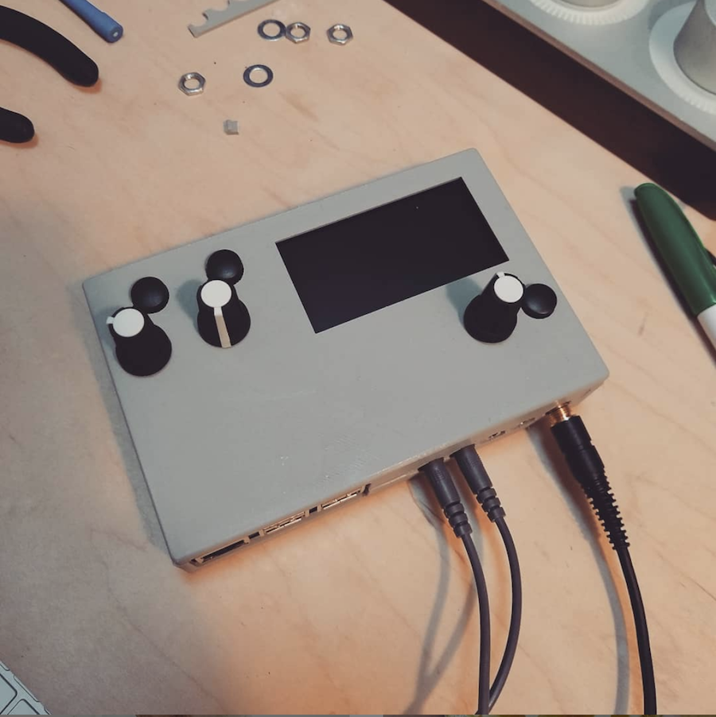

# Fates 3d case

### What this is

- This is a 3d printed case for the DIY Monome Norns kit called Fates created by @denki_oto
- It was remixed by James Hagerman based on the work done by coreyker
- coreyker's original design work is found in the upstream fork here: https://github.com/coreyker/fates3d_case
- The remix and the original case designs were created in Fusion 360

### Why a Remix?

James Everitt originally added a USB-C slot and a hole for the 4th optional encoder supported by the PCB.

I wanted to modify the case further, but didn't have Everitt's updated Fusion 360 files. Therefore, I re-created Everitt's changes and continued adding a number of additional modifications to make the case more sturdy than the original

This remix is a modified design that uses screws, nuts on the encoder shafts, an internal bracket, and various moldings to hole the two halves of the case together without the creaking associated with so many 3D printed designs.

### What is missing

- Still no consideration has been given to cooling/air flow. Heat and PLA don't play well together anyways. (Let me known in a GitHub issue and I'll do what I can to add some cooling option.)
- A screen protector! Having a clean way to protect the $40 OLED display would be a good addition.

### Before you print this please know that:

- This is not perfect; no 3d printing is.
- The design was test printed in PLA on a Prusa i3 MK3s. This version has not been tested on any other printers.

### Licence

- Creative Commons: Attribution-NonCommercial-ShareAlike 4.0 International
- In other words: you cannot sell this, and if you modify the design you cannot sell that either. Otherwise do whatever your heart desires
